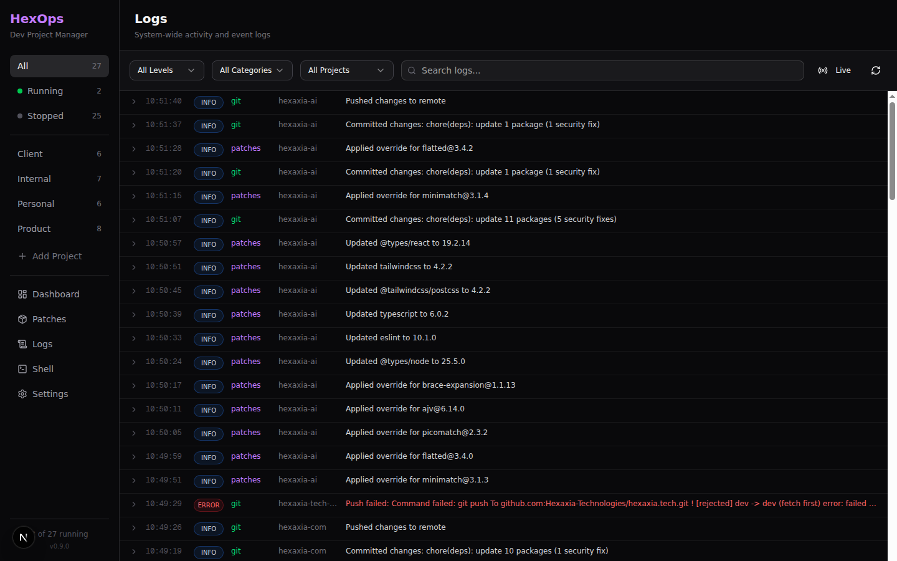

# HexOps

**Stop juggling terminal tabs. One dashboard for all your projects.**

Manage 5, 15, or 50+ local dev projects from a single web interface. Start/stop servers, batch-patch vulnerabilities, monitor system health, and deploy to Vercel without touching a terminal.


---

## The Problem

You have 15 local projects. A critical CVE drops. Now you need to:

1. `cd project-a && pnpm audit && pnpm update && git commit...`
2. Repeat 14 more times.
3. Miss one. Find out the hard way.

Or you could open HexOps and patch all 15 in 5 minutes.

---

## Screenshots

### Dashboard
27 projects at a glance. System health gauges, git status, package counts, start/stop any server with one click.


### Patch Scanner
97 outdated packages across 22 projects. Severity-ranked priority queue. Batch select, update, commit, push. Hold packages that break things.


### Activity Logs
Every operation logged with timestamps, levels, and categories. Filter by project, search, or watch live.



---

## What It Does

| Feature | What You Get |
|---------|-------------|
| **Project Dashboard** | See all projects in one view. Start/stop dev servers. View git branch, port, uptime, memory. |
| **Patch Scanner** | Scan every project for vulnerabilities and outdated packages. Batch update with one click. |
| **Package Holds** | Skip packages that break things (per-project). ESLint major upgrade? Hold it until you're ready. |
| **Integrated Shell** | Full PTY terminal in the browser via xterm.js. No more "which tab was that?" |
| **System Health** | Real-time CPU, memory, disk gauges with color-coded thresholds. |
| **Git Controls** | View status, commit, push, pull from the UI. Auto-commit after patches with editable messages. |
| **Vercel Deploy** | Deploy preview or production builds directly from the dashboard. |
| **Centralized Logs** | JSON Lines format. Filter by level, category, project. Live mode with auto-refresh. |
| **Per-Project Settings** | Environment vars, Node version overrides, shell selection, deploy config, monitoring. |

---

## Real Numbers

We use HexOps daily to manage 27 projects across 4 categories:

| Metric | Value |
|--------|-------|
| Projects managed | 27 |
| Categories | Client, Internal, Personal, Product |
| Packages scanned per run | 97 outdated across 22 projects |
| Time to patch all projects | ~5 minutes (vs ~2 hours manually) |
| Bug fixes for npm/pnpm edge cases | 7 (and counting) |

The patch scanner handles real-world messiness that other tools don't: npm v7+ audit format differences, pnpm transitive dependency detection, lockfile corruption, `ERESOLVE` peer dep conflicts with automatic `--legacy-peer-deps` retry, and post-install version verification.

---

## How It Compares

| | HexOps | pm2 | Portainer | Renovate/Dependabot | Manual Terminals |
|--|:------:|:---:|:---------:|:-------------------:|:----------------:|
| Web dashboard | Yes | No (CLI) | Yes | No | No |
| Multi-repo management | Yes | Limited | Docker only | Yes (CI) | Manual |
| Vulnerability scanning | Yes | No | No | Yes | Manual |
| Batch patching | Yes | No | No | PR-based | Manual |
| Package holds | Yes | No | No | No | N/A |
| Integrated terminal | Yes | No | Yes | No | N/A |
| System health monitoring | Yes | Yes | Yes | No | Manual |
| Git integration | Yes | No | No | Yes | Manual |
| Vercel deploy | Yes | No | No | No | CLI |
| No containers required | Yes | Yes | No | Yes | Yes |
| Local-first (no CI needed) | Yes | Yes | No | No | Yes |

---

## Quick Start

```bash
# Clone
git clone https://github.com/Hexaxia-Technologies/hexops.git
cd hexops

# Install
pnpm install

# Configure
cp hexops.config.example.json hexops.config.json
# Edit hexops.config.json — add your project paths

# Run
pnpm dev
```

Open [http://localhost:3000](http://localhost:3000).

### Minimal Config

```json
{
  "projects": [
    {
      "id": "my-app",
      "name": "My App",
      "path": "/home/you/projects/my-app",
      "port": 3001,
      "category": "Product",
      "scripts": { "dev": "pnpm dev" }
    }
  ],
  "categories": ["Product", "Client", "Internal"]
}
```

Add as many projects as you want. HexOps scans them all.

---

## Tech Stack

- **Next.js 16** (App Router) + **React 19**
- **Tailwind CSS v4** + **shadcn/ui** + **Radix UI**
- **xterm.js** + **node-pty** (WebSocket-driven PTY shell)
- **Recharts** (system health gauges)
- **Custom server** (WebSocket for shell + HMR co-existence)

## Requirements

- Node.js 20+
- pnpm 9+
- Git

---

## Documentation

| Doc | What's In It |
|-----|-------------|
| [Getting Started](docs/getting-started.md) | Installation, config, first run |
| [Configuration](docs/configuration.md) | Full JSON config schema reference |
| [Architecture](docs/development/architecture.md) | System design, data flow, API reference |
| [Features](docs/features/) | Per-feature deep dives |

---

## Security

> **HexOps is designed for local use only. Never expose it to the internet.**

HexOps provides full shell access and process control. These are powerful features for local development that would be dangerous if exposed publicly. Always run on `localhost`. If you need remote access, use SSH tunneling or a VPN.

---

## Roadmap

- [ ] MCP server for Claude Code integration (#45)
- [ ] Pre-patch build validation (#29)
- [ ] Static security scanner (#46)
- [ ] Supply chain detection (#47)
- [ ] Scheduled operations (auto-scan, auto-patch)
- [ ] Multi-user mode with auth
- [ ] Docker image for instant setup

---

## Contributing

Contributions welcome! See [CONTRIBUTING.md](CONTRIBUTING.md) for guidelines.

---

## About

Built by [Hexaxia Technologies](https://hexaxia.tech). We manage 27 projects with HexOps every day. It's the tool we wished existed, so we built it.

## License

MIT - see [LICENSE](LICENSE).
